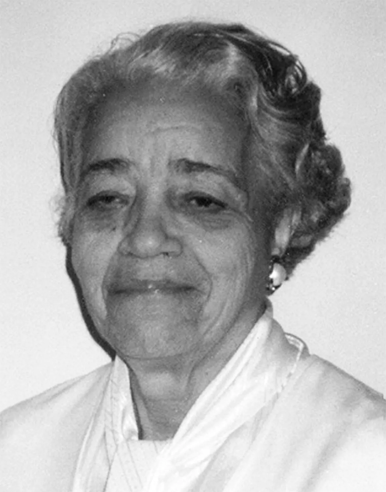
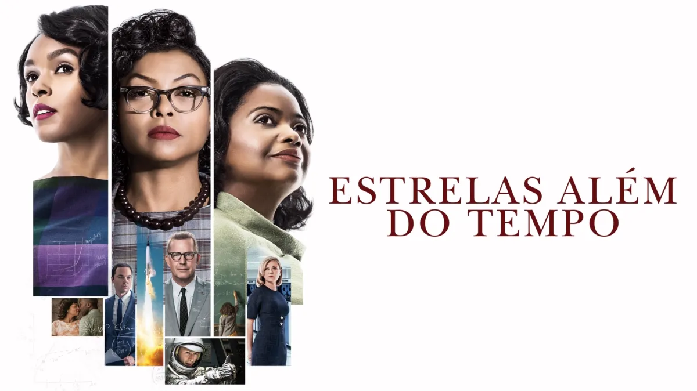

# Dorothy Vaughan

```
Este repositório foi criado para atividade de Git e GitHub do Bootcamp Data Analytics da WoMakersCode.
```

## [Sobre a WoMakersCode](https://www.womakerscode.org/)
```
A WoMakersCode foi fundada em 2015 com o propósito de ampliar o acesso de mulheres
à tecnologia e apoiar o desenvolvimento de suas carreiras na área.
Idealizada por Cynthia Zanoni, a iniciativa começou conectando mulheres
interessadas em tecnologia e criando oportunidades de aprendizado, troca e crescimento profissional.

Com a expansão da comunidade e o fortalecimento das suas iniciativas,
em 2021 a WoMakersCode se tornou uma organização sem fins lucrativos (ONG)
de inclusão produtiva de mulheres na tecnologia, ampliando sua atuação em formação técnica, mentoria e empregabilidade.

Hoje, a organização conecta mulheres em diferentes países e fortalece
um ecossistema que impulsiona carreiras e amplia oportunidades no mercado de tecnologia.

Promover a transformação faz parte da nossa essência.

```

<p>
  
</p>


## 🪪 Biografia:



Dorothy Vaughan (1910–2008) foi uma matemática, professora e cientista norte-americana que trabalhou no antigo Comitê Consultivo Nacional para Aeronáutica (NACA), que mais tarde se tornou a NASA. Ela nasceu em Kansas City e destacou-se em uma época marcada pela segregação racial e desigualdade de gênero nos Estados Unidos.  

Durante sua carreira, Dorothy trabalhou com cálculos matemáticos essenciais para pesquisas aeronáuticas e missões espaciais. Posteriormente, tornou-se especialista em programação, aprendendo linguagens como FORTRAN para acompanhar a chegada dos computadores.  

## 🏅 Principais conquistas:
* Primeira supervisora negra da NACA/NASA: tornou-se líder da equipe conhecida como West Area Computers, formada por mulheres negras responsáveis por cálculos matemáticos avançados.
* Contribuição para a corrida espacial: seu trabalho ajudou no desenvolvimento de pesquisas aeronáuticas e espaciais que influenciaram missões importantes.
* Pioneirismo em programação: percebeu cedo que os computadores substituiriam cálculos manuais e aprendeu programação, ajudando outras mulheres a se adaptarem às novas tecnologias.
* Liderança e inclusão: abriu caminhos para mulheres negras em áreas de ciência, tecnologia, engenharia e matemática (STEM).

## 👀 Curiosidades e impacto na sociedade/tecnologia/ciência
* Sua história ganhou maior reconhecimento com o livro e o filme Hidden Figures (Estrelas Além do Tempo), que mostra a trajetória das cientistas negras Dorothy Vaughan, Katherine Johnson e Mary Jackson na NASA durante a guerra fria.
* Dorothy enfrentou barreiras de racismo e sexismo, mas conseguiu ocupar posições de liderança em um ambiente dominado por homens brancos.
* Seu trabalho influenciou a transição dos cálculos manuais para a computação, contribuindo para a modernização tecnológica na área aeroespacial.
* Hoje, ela é considerada um símbolo de representatividade feminina e negra na ciência e tecnologia, inspirando novas gerações a seguirem carreiras em STEM.


### Estrelas Além do Tempo, 2018:


### Cientistas inspiradoras do filme:

Da esquerda para a direita: Katherine Johnson, Mary Jackson e Dorothy Vaughan.

#### Sinopse:
Em, 1961, plena Guerra Fria, Estados Unidos e União Soviética disputam a supremacia na corrida espacial ao mesmo tempo em que a sociedade norte-americana lida com uma profunda cisão racial, entre brancos e negros. Tal situação é refletida também na NASA, onde um grupo de funcionárias negras é obrigada a trabalhar a parte. É lá que estão Katherine Johnson (Taraji P. Henson), Dorothy Vaughn (Octavia Spencer) e Mary Jackson (Janelle Monáe), grandes amigas que, além de provar sua competência dia após dia, precisam lidar com o preconceito arraigado para que consigam ascender na hierarquia da NASA.

[Filme disponível no Disney+](https://www.disneyplus.com/pt-br)

#### Elenco:
* Taraji P. Henson como Katherine Johnson.
* Octavia Spencer como Dorothy Vaughan.
* Janelle Monáe como Mary Jackson.

# 👩🏻‍💻 O que aprendi de Git e GitHub?
## 💻 Comandos Git
* git checkout -b nome-da-branch: cria nova branch
* git checkout nome-da-branch: lista todas as branchs
* git branch: lista todas as branchs locais
* git pull: puxa as atualizações mais recente (remoto -> local)
* git push: envia as atualizações mais recentes (local -> remoto)

O destaque em verde mostra qual branch estou no momento:


``Todas as alterações que fiz explicando os comandos git foram feitas em nova branch.``

